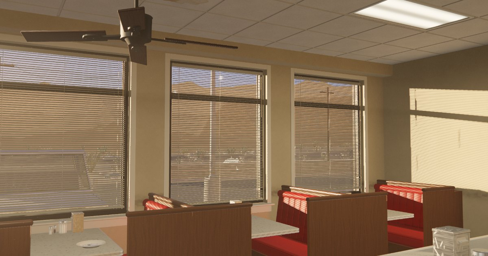

# Morning Diner

**Live: <https://starknightt.github.io/morning-diner/>** — click to enter, WASD to walk.



A photoreal first-person walk through a diner at golden hour, built in
Three.js (Vite + TypeScript) with zero external assets: every texture is generated in Workers at
boot, the room, counter, kitchen, lot, cars and the desert world outside are built from code, lit
by a two-sun rig with baked probes and a HDR post chain (haze, bloom, MSAA 4×). Walk in, sit down,
pour a coffee, look out through the blinds.

Original brief: [docs/PROMPT.md](docs/PROMPT.md) — the prompt this project was built from, verbatim.

## Run it locally

```
npm install && npx vite        # then open the printed URL, click to enter
npm run build                  # tsc --noEmit && vite build
GITHUB_PAGES=1 npm run build   # the Pages build (base /morning-diner/), see .github/workflows/pages.yml
node tools/shoot.mjs           # headless capture of the reference poses → shots/
```

Pushing to `main` deploys to GitHub Pages through `.github/workflows/pages.yml`.

## Controls

| Key | Action |
|---|---|
| `W A S D` / mouse | walk / look (click the canvas for pointer lock) |
| `Shift` | sprint |
| `Space` | hop |
| `E` | interact: open doors and cabinets, sit on a bench or stool, pour, drink |
| `Q` | stand up |
| `F` | tilt the blinds you are looking at |
| `[` / `]` | exposure −/+ |
| touch | left half of the screen: walk stick · right half: look drag · tap: `E` (no pointer lock) |

## Quality

The build picks a tier for the device on boot — `ultra` (the RTX-class look), `high`, `medium`,
`low`, `mobile` — from the GPU string and WebGL limits, then steps the render resolution down
when frames run over 20 ms and back up when they stay under 10 ms. `?q=low` (or `medium` /
`high` / `ultra` / `mobile`) forces a tier and remembers it; `?q=auto` forgets. The loader shows
the tier bottom right; `window.__quality` has the reasons. See BUILD.md "Quality tiers".

## Lighting

The scene is lit with the 6:45 PM evening preset (golden hour, sun 9° up). `?ev=±n` in the URL
offsets the exposure by n stops (`[` `]` do the same live); see BUILD.md "Evening preset".

## How it's built

- **Procedural everything** — no model, texture, HDR or font files; the site is one HTML file, one bundle and one Web Worker script.
- **Textures in Workers** — formica, vinyl, terrazzo, stucco, asphalt, chrome wear are synthesised off the main thread at boot (`src/procedural/`, `core/textureBank.ts`).
- **PCSS sun** — percentage-closer soft shadows on the spot sun through the windows, with a detached beam twin for the post chain.
- **Analytic slat shadows** — the venetian blinds stay out of the shadow map; their stripes are a closed-form transmittance convolved with the sun disc in the shader.
- **Bounce rects** — rectangle form-factor first bounce from the baked sun patches, RectAreaLight troffers and window fills, on top of baked reflection probes.
- **Custom tonemap** — a camera curve (hue-preserving knee, Hable shoulder, print toe) with physical exposure (ISO · f-stop · shutter), haze and Karis bloom in HDR.

Build notes, per-system verification and the capture / bench harnesses: `BUILD.md`.
